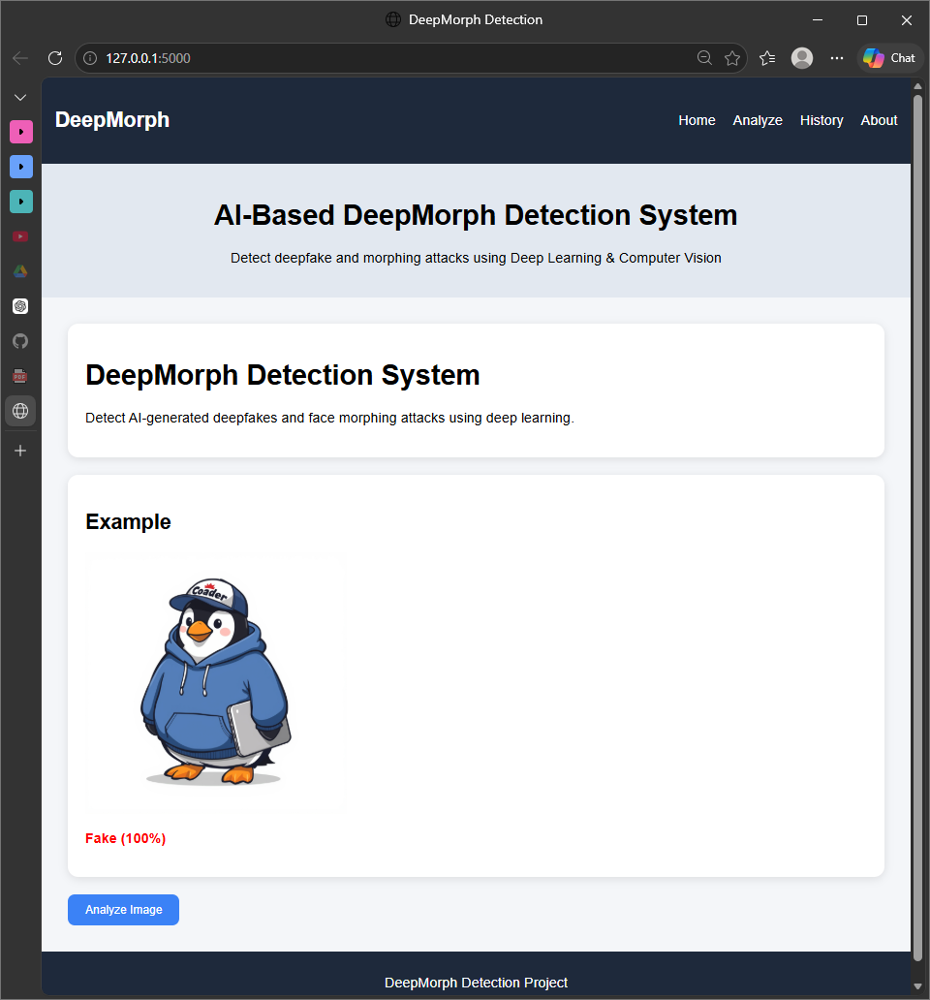
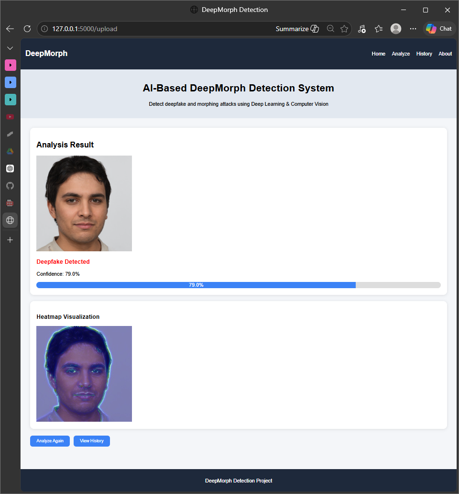
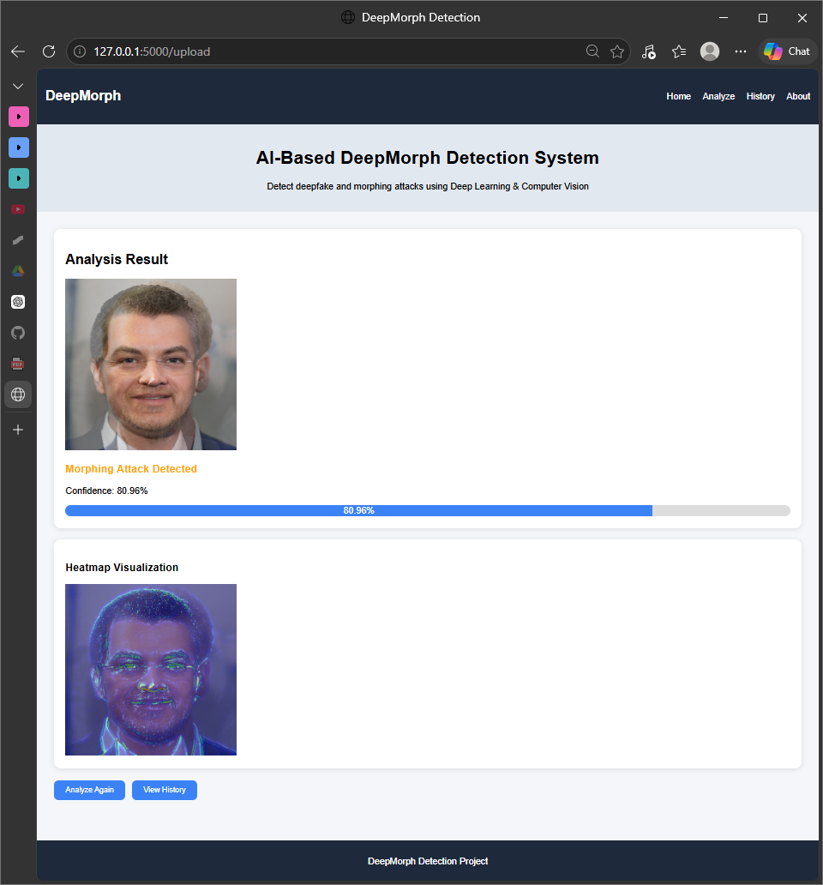
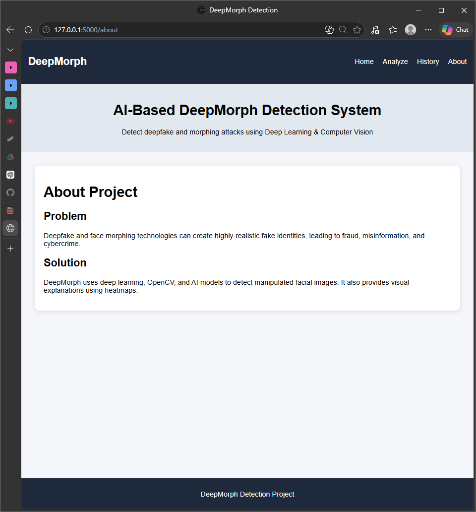
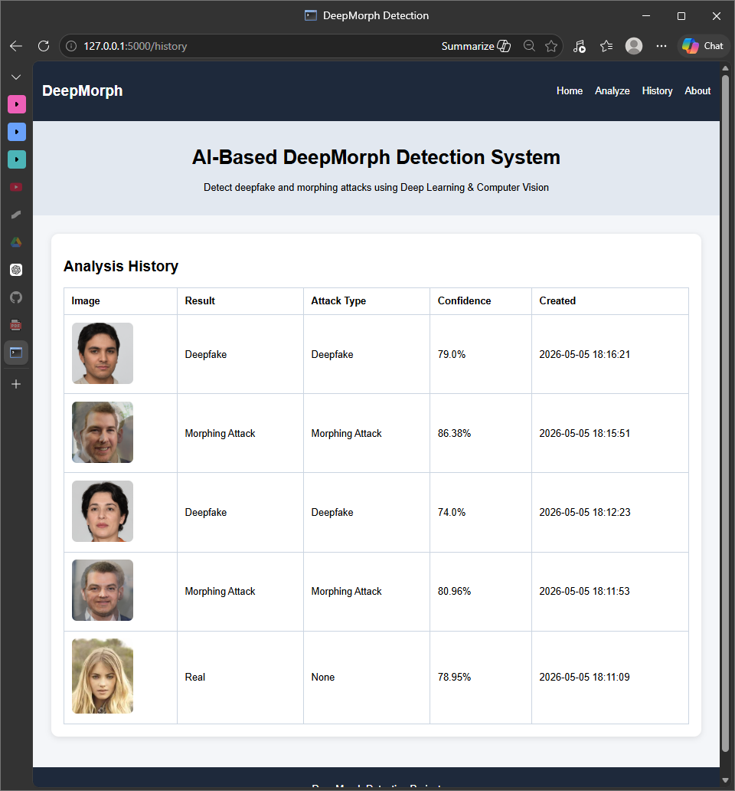

# DeepMorph Detection Project

DeepMorph is a Flask-based hybrid detection system for identifying manipulated facial images. The project detects three main outcomes:

- Real Image
- Deepfake
- Morphing Attack

The system uses computer vision preprocessing, feature-based prediction, dataset reference matching, morph detection logic, heatmap visualization, and MySQL history storage.

## Project Structure

```text
deepfake-detector/
|-- app.py
|-- requirements.txt
|-- split_dataset.py
|-- .env
|-- database/
|   |-- db.py
|   `-- db.sql
|-- dataset/
|   |-- Human Faces Dataset/
|   |   |-- AI-Generated Images/
|   |   |-- morphed-im/
|   |   `-- Real Images/
|   `-- hybrid_faces/
|-- model/
|   |-- deepfake_model.h5
|   |-- gradcam.py
|   |-- hybrid_centroids.npz
|   |-- hybrid_reference_vectors.npz
|   |-- morph_detection.py
|   |-- predict.py
|   `-- preprocess.py
|-- static/
|   |-- css/
|   |   `-- style.css
|   |-- images/
|   |   |-- example.jpg
|   |   |-- Home.png
|   |   |-- deepfake_result.png
|   |   |-- Morphing_result.png
|   |   |-- about.png
|   |   `-- history.png
|   `-- uploads/
`-- templates/
    |-- base.html
    |-- home.html
    |-- analyze.html
    |-- result.html
    |-- history.html
    `-- about.html
```

## Features

- Upload facial images for analysis
- Detect real, deepfake, and morphing attack images
- Hybrid prediction using image features and dataset reference support
- Face detection using OpenCV
- Heatmap visualization for manipulated images
- MySQL database storage for analysis history
- History page for viewing previous results

## Screenshots

### Home Page



### Deepfake Result



### Morphing Attack Result



### About Page



### History Page



## Requirements

- Python
- Flask
- OpenCV
- NumPy
- TensorFlow
- PyMySQL
- MySQL Server

Install dependencies:

```powershell
pip install -r requirements.txt
```

## Database Setup

Create the MySQL database and table by running:

```sql
SOURCE C:/Users/asus/deepfake-detector/database/db.sql;
```

Or manually run the SQL from:

```text
database/db.sql
```

The database table stores:

- image path
- prediction result
- confidence
- attack type
- created date and time

## Environment Variables

Database settings are stored in `.env`:

```text
DB_HOST=127.0.0.1
DB_USER=root
DB_PASSWORD=sql
DB_NAME=deepfake_db
```

Update these values if your MySQL username, password, or database name is different.

## Run the Project

Start the Flask app:

```powershell
python app.py
```

Open the website:

```text
http://127.0.0.1:5000
```

## Heatmap Note

Heatmaps are generated only for manipulated images:

- Deepfake
- Morphing Attack

For real images, heatmap is not shown because no manipulation region is detected.

## Project Summary

DeepMorph is a hybrid facial manipulation detection project. It combines dataset support and image feature analysis to identify real images, deepfakes, and morphing attacks through a simple Flask web interface.
